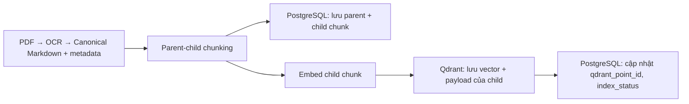

Parent 1
 ├─ Child 1.1
 ├─ Child 1.2
 └─ Child 1.3
Parent 2
 ├─ Child 2.1
 └─ Child 2.2

**Mỗi chunk có cấu trúc như sau:**

{
  "document_key": "quy-dinh-hoc-vu",
  "version_key": "v1",
  "chunk_key": "v1::c::0001",
  "parent_chunk_key": "v1::p::0001",
  "chunk_index": 1,
  "chunk_type": "child",
  "content": "Nội dung đoạn nhỏ...",
  "heading_path": ["Quy chế đào tạo", "Đăng ký học phần"],
  "page_start": 3,
  "page_end": 3,
  "token_count": 180,
  "metadata": {}
}

Quy ước chính:

* **Parent** : `chunk_type = "parent"`, không có `parent_chunk_key`; được tách theo Markdown heading (`#`, `##`, …).
* **Child** : `chunk_type = "child"`, bắt buộc có `parent_chunk_key` trỏ đến parent chứa nó.
* Key được sinh ổn định:
  * Parent: `v1::p::0001`
  * Child: `v1::c::0001`
* Child kế thừa `heading_path` từ parent.
* Child được cắt từ parent theo kích thước chunk và overlap; nếu child không có số trang riêng thì kế thừa khoảng trang của parent.

Định nghĩa cấu trúc này nằm tại [chunks.py](D:\\Code\\CTU_Student_Service\\CSS-CTU-Student-Service\\backend\\app\\schemas\\chunks.py), còn quy tắc tạo parent/child ở [parent_chunker.py](D:\\Code\\CTU_Student_Service\\CSS-CTU-Student-Service\\backend\\app\\ingestion\\chunking\\parent_chunker.py) và [child_chunker.py](D:\\Code\\CTU_Student_Service\\CSS-CTU-Student-Service\\backend\\app\\ingestion\\chunking\\child_chunker.py).

---

Kết quả trả về từ dense + parse phải có chunk_id và postgres_chunk_id

```
postgres_chunk_id  → ID bản ghi chunk trong PostgreSQL
chunk_key          → khóa nghiệp vụ, dễ đọc và ổn định theo version
qdrant_point_id    → ID bản ghi vector trong Qdrant
```

---

## Luồng Ingestion



## 1. PostgreSQL

PostgreSQL sẽ là nguồn dữ liệu chuẩn (canonical source): lưu cả parent và child chunk vào bảng document_chunks, gồm:

document_version_id
parent_chunk_id
chunk_key
chunk_index
chunk_type: parent | child
heading_path, section_title
content
page_start, page_end
token_count
qdrant_point_id
index_status

- Parent chunk không được embed, nhưng được giữ trong PostgreSQL để hydration/expansion lấy thêm ngữ cảnh cha.
- Chỉ **child chunk** được đưa qua embedding. Text dùng để embed gồm title, department, document type, heading, trang và content của child chunk.

## 2. Qdrant

Qdrant: chỉ lưu một point cho mỗi child chunk:

point_id = UUID5(version_key + chunk_key)
vector   = embedding của child chunk
payload  = metadata để filter, search và truy vết

payload của Qdrant gồm:

{
  "document_key": "...",
  "version_key": "...",
  "title": "...",
  "department": "...",
  "document_type": "...",
  "domain": "...",
  "chunk_key": "...",
  "parent_chunk_key": "...",
  "chunk_type": "child",
  "heading_path": ["..."],
  "page_start": 1,
  "page_end": 1,
  "content": "...",
  "postgres_chunk_id": 42,
  "review_status": "approved",
  "rag_status": "published",
  "audience": ["sinh_vien"]
}

=> Sau khi upsert Qdrant thành công, PostgreSQL cập nhật cho mỗi child chunk:

**qdrant_point_id = ID point trong Qdrant
index_status = indexed**

và phiên bản tài liệu rag_status = published

---

Khử trùng tại liệu khi chat đưa nguồn tham khảo (tránh lặp lại)

Trong rag_chain.py: hàm build_answer_citations sẽ khử trùng theo: tài liệu + phiên bản + khoảng trang thay vì theo chunk_key

---

## Còn 1 vài lỗi chưa xử lý ổn:

1/ **Các trường hợp người dùng gửi câu hỏi mơ hồ không ngữ cảnh thì xử lý ntn, để tránh trùng với câu hỏi không ngữ cảnh khi đã có topic trước đó**

Câu hỏi vào
│
├─ Câu RÕ (có chủ thể: "điều kiện học bổng")     → heuristic cho qua ngay, KHÔNG gọi LLM phân loại
│                                   → chỉ tốn ~0ms
│
├─ Câu CHẮC CHẮN mơ hồ ("điều kiện")             → heuristic chặn ngay, hỏi lại, KHÔNG gọi LLM
│   + không có ngữ cảnh                → chỉ tốn ~0ms
│
└─ Câu VÙNG XÁM (đáng ngờ, khó nói)              → mới gọi LLM phân loại
→ tốn ~0,5–1,5s

Có nhiều cách xử lý:

- Heuristic + ngữ cảnh(chưa tối ưu vẫn có thể gây nhầm lẫn) nhưng ít tốn tg gen câu trl: luôn đảm bảo <1ms và ổn định
- nếu dùng LLM phân loại + ngữ cảnh thì chính xác hơn nhưng sẽ + thêm 1 lượt gọi LLM (chậm hơn và tốn hơn): có thể tốn đến 0.5s - 1.5s. Nếu provider quá tải có thể sẽ lên tới 2-3s
- Hybrid heuristic + llm: heuristic phân loại đó là câu hỏi có cần gọi tới llm hay không, hay tự nó xử lý được: với phương án này thì có thể sẽ khắc phục được hạn chế của việc tốn tg cho tất cả prompt của llm. Vì chỉ khi câu hỏi thuộc vùng xám cần llm phân loại => tốn thời gian. KHÁ PHỨC TẠP

2/ Đổi reranker từ dùng LexicalReranker -> Cross-Encoder với model bge-reranker-v2-m3 giống model của embedding. Tạo thêm 1 container tei thứ 2 cho reranker

---

## Lệnh khởi động docker

**cd CSS-CTU-Student-Service**

**docker compose up -d**

Các lệnh hay dùng khác:

```powershell
docker compose ps            # xem trạng thái các container
docker compose logs -f       # xem log tất cả service
docker compose logs -f qdrant   # xem log 1 service
docker compose down          # dừng và xóa container (giữ lại data trong volume)
docker compose up -d postgres qdrant   # chỉ khởi động service cần thiết
```

## Lệnh tạo key tei:

**python -c "import secrets; print(secrets.token_hex(32))"**

## Truy cập vào trang openRouter để lấy key cho model Qwen

## Lệnh chạy backend: lệnh này chạy được ở cả 2 môi trường: emulator và chrome

**cd backend**

Khởi động venv:

**`.\.venv\Scripts\Activate.ps1`**

python -m uvicorn app.main:app --host 0.0.0.0 --port 8000 --reload

Nếu lỗi uvicorn thì do transformers yêu cầu >= 2.4, cần nâng cấp pytorch:

**pip install --upgrade torch torchvision torchaudio**

Với điện thoại thật: dùng IP LAN

## Lệnh chạy frontend:

- **cd myapp/frontend**
- **Kiểm tra các thiết bị hiện có: flutter devices**
- **Run: flutter run -d <tên TB>**

---

# API_KEY


| Key                                              | Provider                               | Dùng                                                 | Limit                                                                                  |
| -------------------------------------------------- | ---------------------------------------- | ------------------------------------------------------- | ---------------------------------------------------------------------------------------- |
| LLM_API_KEY                                      | OpenRouter, endpoint OpenAI-compatible | Sinh câu trả lời RAG                               | `max_tokens=1024`timeout mặc định `45s`, model `qwen/qwen3-next-80b-a3b-instruct`   |
| `CLOUDFLARE_API_TOKEN` + `CLOUDFLARE_ACCOUNT_ID` | Cloudflare Workers AI                  | Tạo embedding cho query/chunks                       | batch size`4`, timeout HTTP `120s`, vector size yêu cầu `1024`                       |
| JINA_API_KEY                                     | Jina AI                                | Rerank kết quả cho retrieval sau RRF                | timeout`.env` đang là `60s`, `top_n = len(documents)`                                |
| QDRANT_API_KEY                                   | Qdrant Cloud                           | Lưu/Search vector database                           | retrieval config:`top_k=5`, `candidate_k=30`; quota thật nằm ở Qdrant Cloud plan    |
| `R2_ACCESS_KEY_ID` + `R2_SECRET_ACCESS_KEY`      | Cloudflare R2                          | Lưu Markdown/PDF nguồn, tạo preview URL            | Markdown tối đa`20MB`, source file tối đa `100MB`, preview URL hết hạn `5 phút` |
| PostgreSQL                                       | Neon Postgre                           | Metadata DB, sparse retrieval, document/chunk records |                                                                                        |
|                                                  |                                        |                                                       |                                                                                        |
|                                                  |                                        |                                                       |                                                                                        |

---

PREVIEW 10/08/2026

Những chỗ cần cải tiến trong retrieval

Ưu tiên nên làm:

1. **Tối ưu latency trong `s10_retriever.py`**
   Hiện mỗi query rewrite chạy dense rồi sparse tuần tự. Có thể chạy dense và sparse song song bằng `asyncio.gather`. Nếu có 3 query variants, hiện pipeline dễ bị chậm vì gọi nối tiếp.

-> Done

2. **Giới hạn expansion trong `s9_expansion.py`**
   Structural expansion hiện có thể thêm parent, children, siblings, split neighbors cho từng direct hit. Nên có `max_expanded_results` hoặc dedupe + limit theo budget trước khi trả sang LLM, tránh context phình quá nhiều và làm câu trả lời nhiễu.

-> done

3. **Dedupe cuối sau expansion**
   `s6_fusion.py` có dedupe theo `chunk_key`, nhưng sau `s9_expansion.py` có thể lại sinh trùng. Nên dedupe `version_key + chunk_key + expansion_reason` hoặc ưu tiên direct hit rồi bỏ bản trùng expansion.

-> done

4. **Thêm score threshold sau rerank**
   Trong `runtime.yaml` có `score_threshold: 0.5` nhưng mình chưa thấy được dùng rõ trong retrieval pipeline. Nếu Jina reranker trả relevance thấp, nên cắt bớt trước khi build context.

`score_threshold: 0.5` dùng để  **loại bỏ kết quả retrieval quá yếu** , không đưa vào expansion/context/LLM.

Ví dụ sau rerank có kết quả:

```
chunk A: 0.92
chunk B: 0.74
chunk C: 0.51
chunk D: 0.22
chunk E: 0.08
```

Nếu threshold là `0.5`, chỉ giữ:

```
A, B, C
```

Còn D/E bị bỏ vì khả năng liên quan thấp.

Mục đích:

* giảm context nhiễu,
* tránh LLM đọc nhầm đoạn không liên quan,
* tiết kiệm token,
* không expansion từ những chunk yếu.

=> Giữ lại chưa đưa vào pipeline

6. **Log/trace retrieval để debug chất lượng**
   Nên log top candidates gồm: query variant, dense/sparse rank, RRF score, rerank score, document/version/chunk. Cái này cực hữu ích để biết sai do chunking, embedding, sparse, rerank hay prompt.
7. **RRF trong `s6_fusion.py` chưa cần đổi**
   Công thức RRF hiện ổn. Không nên cộng `is_latest` vào RRF vì `is_latest` là filter cứng. Nếu cải tiến fusion, nên cân nhắc weighted RRF, ví dụ dense weight cao hơn sparse cho câu hỏi ngữ nghĩa, sparse cao hơn cho câu hỏi mã biểu mẫu/quyết định/số hiệu.
8. **Metadata filter `s2` nên cẩn thận**
   Hiện code có comment đúng: không dùng alias suy đoán làm hard filter. Cái này nên giữ. Nếu muốn tối ưu, chỉ hard filter khi user nêu rõ mã văn bản, phòng ban, version, hoặc document key.

---

## HƯỚNG DẪN XUẤT FILE APK

cd D:\Code\CTU_Student_Service\ctu_chatbot\myapp\frontend
flutter clean
flutter pub get
flutter build apk --release

file đã xuất apk nằm theo path này

D:\Code\CTU_Student_Service\ctu_chatbot\myapp\frontend\build\app\outputs\flutter-apk\app-release.apk

Điện thoại và máy chạy backend phải cùng WiFi, backend phải đang chạy, và Windows Firewall phải cho phép port `8000`.

Khi cài APK nội bộ, điện thoại có thể hỏi “Install unknown apps” / “Cài ứng dụng không rõ nguồn gốc” → bật cho app bạn dùng để mở file APK.

flutter build apk --release -- dart-define=API_BASE_URL=http://[ip lan của máy]:8000

**Xuất apk lên server**

**flutter build apk --release --dart-define=API_BASE_URL=https://css-ctu-student-service-api.onrender.com**

VD:

flutter build apk --release -- dart-define=API_BASE_URL=http://192.168.1.77:8000

Cách 2: Thêm 1 màn hình cho nhập IP, không cần phải build lại apk khi chạy trên mỗi máy khác nhau

-------------------------------------------------------------------------------------------------------------------
BM25

ĐỔI HÀM TÍNH SCORE CỦA POSTGRESQL - FTS (SPARSE) TỪ ts_rank_cd -> bm25
PostgreSQL FTS
      ↓
lọc candidate
      ↓
BM25Okapi.get_scores()
      ↓
_score = BM25 score
      ↓
RRF


số lần từ xuất hiện trong document,
số document chứa từ đó,
độ dài document,
độ dài trung bình của corpus: số lượng từ trung bình của tất cả document/chunk trong tập dữ liệu.

pip install rank-bm25