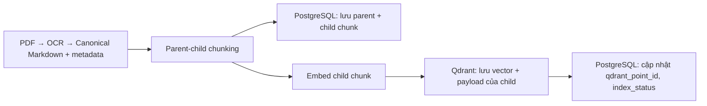

Parent 1
 ├─ Child 1.1
 ├─ Child 1.2
 └─ Child 1.3
Parent 2
 ├─ Child 2.1
 └─ Child 2.2

**Mỗi chunk có cấu trúc như sau:**

{
  "document_key": "quy-dinh-hoc-vu",
  "version_key": "v1",
  "chunk_key": "v1::c::0001",
  "parent_chunk_key": "v1::p::0001",
  "chunk_index": 1,
  "chunk_type": "child",
  "content": "Nội dung đoạn nhỏ...",
  "heading_path": ["Quy chế đào tạo", "Đăng ký học phần"],
  "page_start": 3,
  "page_end": 3,
  "token_count": 180,
  "metadata": {}
}

Quy ước chính:

* **Parent** : `chunk_type = "parent"`, không có `parent_chunk_key`; được tách theo Markdown heading (`#`, `##`, …).
* **Child** : `chunk_type = "child"`, bắt buộc có `parent_chunk_key` trỏ đến parent chứa nó.
* Key được sinh ổn định:
  * Parent: `v1::p::0001`
  * Child: `v1::c::0001`
* Child kế thừa `heading_path` từ parent.
* Child được cắt từ parent theo kích thước chunk và overlap; nếu child không có số trang riêng thì kế thừa khoảng trang của parent.

Định nghĩa cấu trúc này nằm tại [chunks.py](D:\\Code\\CTU_Student_Service\\CSS-CTU-Student-Service\\backend\\app\\schemas\\chunks.py), còn quy tắc tạo parent/child ở [parent_chunker.py](D:\\Code\\CTU_Student_Service\\CSS-CTU-Student-Service\\backend\\app\\ingestion\\chunking\\parent_chunker.py) và [child_chunker.py](D:\\Code\\CTU_Student_Service\\CSS-CTU-Student-Service\\backend\\app\\ingestion\\chunking\\child_chunker.py).

---

Kết quả trả về từ dense + parse phải có chunk_id và postgres_chunk_id

```
postgres_chunk_id  → ID bản ghi chunk trong PostgreSQL
chunk_key          → khóa nghiệp vụ, dễ đọc và ổn định theo version
qdrant_point_id    → ID bản ghi vector trong Qdrant
```

---

# Luồng Ingestion



## 1. PostgreSQL

PostgreSQL sẽ là nguồn dữ liệu chuẩn (canonical source): lưu cả parent và child chunk vào bảng document_chunks, gồm:

document_version_id
parent_chunk_id
chunk_key
chunk_index
chunk_type: parent | child
heading_path, section_title
content
page_start, page_end
token_count
qdrant_point_id
index_status

- Parent chunk không được embed, nhưng được giữ trong PostgreSQL để hydration/expansion lấy thêm ngữ cảnh cha.
- Chỉ **child chunk** được đưa qua embedding. Text dùng để embed gồm title, department, document type, heading, trang và content của child chunk.

## 2. Qdrant

Qdrant: chỉ lưu một point cho mỗi child chunk:

point_id = UUID5(version_key + chunk_key)
vector   = embedding của child chunk
payload  = metadata để filter, search và truy vết

payload của Qdrant gồm:

{
  "document_key": "...",
  "version_key": "...",
  "title": "...",
  "department": "...",
  "document_type": "...",
  "domain": "...",
  "chunk_key": "...",
  "parent_chunk_key": "...",
  "chunk_type": "child",
  "heading_path": ["..."],
  "page_start": 1,
  "page_end": 1,
  "content": "...",
  "postgres_chunk_id": 42,
  "review_status": "approved",
  "rag_status": "published",
  "audience": ["sinh_vien"]
}

=> Sau khi upsert Qdrant thành công, PostgreSQL cập nhật cho mỗi child chunk:

**qdrant_point_id = ID point trong Qdrant
index_status = indexed**

và phiên bản tài liệu rag_status = published

---

Khử trùng tại liệu khi chat đưa nguồn tham khảo (tránh lặp lại)

Trong rag_chain.py: hàm build_answer_citations sẽ khử trùng theo: tài liệu + phiên bản + khoảng trang thay vì theo chunk_key

---

Còn 1 vài lỗi chưa xử lý ổn:

1. **Các trường hợp người dùng gửi câu hỏi mơ hồ không ngữ cảnh thì xử lý ntn, để tránh trùng với câu hỏi không ngữ cảnh khi đã có topic trước đó**

   Câu hỏi vào
      │
      ├─ Câu RÕ (có chủ thể: "điều kiện học bổng")     → heuristic cho qua ngay, KHÔNG gọi LLM phân loại
      │                                   → chỉ tốn ~0ms
      │
      ├─ Câu CHẮC CHẮN mơ hồ ("điều kiện")             → heuristic chặn ngay, hỏi lại, KHÔNG gọi LLM
      │   + không có ngữ cảnh                → chỉ tốn ~0ms
      │
      └─ Câu VÙNG XÁM (đáng ngờ, khó nói)              → mới gọi LLM phân loại
                                           → tốn ~0,5–1,5s

   Có nhiều cách xử lý:

   1. Heuristic + ngữ cảnh(chưa tối ưu vẫn có thể gây nhầm lẫn) nhưng ít tốn tg gen câu trl: luôn đảm bảo <1ms và ổn định
   2. nếu dùng LLM phân loại + ngữ cảnh thì chính xác hơn nhưng sẽ + thêm 1 lượt gọi LLM (chậm hơn và tốn hơn): có thể tốn đến 0.5s - 1.5s. Nếu provider quá tải có thể sẽ lên tới 2-3s
   3. Hybrid heuristic + llm: heuristic phân loại đó là câu hỏi có cần gọi tới llm hay không, hay tự nó xử lý được: với pa này thì có thể sẽ khắc phục được hạn chế của tốn tg cho tất cả prompt của llm. Vì chỉ khi câu hỏi thuộc vùng xám cần llm phân loại => tốn thời gian. KHÁ PHỨC TẠP

---

Lệnh chạy backend: lệnh này chạy được ở cả 2 môi trường: emulator và chrome

python -m uvicorn app.main:app --host 0.0.0.0 --port 8000 --reload

Lệnh chạy frontend:

- cd myapp/frontend
- Kiểm tra các thiết bị hiện có: flutter devices
- Run: flutter run -d <tên TB>
